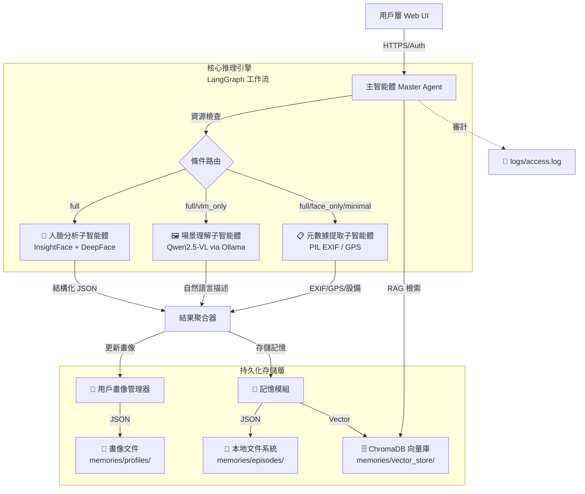
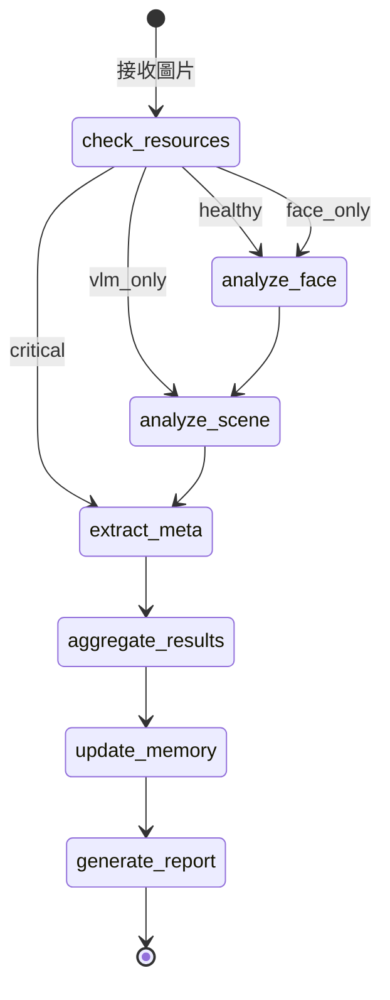

# 🔍 SuperSight V2.1 - 本地 AI 記憶體代理

**SuperSight** 是一個運行在本地端的 AI 記憶體代理（AI Memory Agent）。它不僅識別圖片內容，更通過時間線和上下文構建用戶的「數字自傳」。


---

## 📑 目錄

1. [核心特性](#-核心特性)
2. [系統架構](#-系統架構)
3. [完整工作流程](#-完整工作流程)
4. [系統要求](#-系統要求)
5. [快速開始](#-快速開始)
6. [使用指南](#-使用指南)
7. [10+ 使用場景範例](#-10-使用場景範例)
8. [模組 API 參考](#-模組-api-參考)
9. [專案結構](#️-專案結構)
10. [配置說明](#️-配置說明)
11. [環境變量完整參考](#-環境變量完整參考)
12. [性能調優指南](#-性能調優指南)
13. [性能基準測試](#-性能基準測試)
14. [RAG 檢索流程詳解](#-rag-檢索流程詳解)
15. [安全模型詳解](#-安全模型詳解)
16. [版本歷史 (Changelog)](#-版本歷史-changelog)
17. [架構決策記錄 (ADR)](#-架構決策記錄-adr)
18. [Docker 部署指南](#-docker-部署指南)
19. [故障排除](#-故障排除)
20. [測試](#-測試)
21. [貢獻指南](#-貢獻指南)
22. [附錄：依賴版本對照](#-附錄依賴版本對照)
23. [未來路線圖](#-未來路線圖)
24. [許可證](#-許可證)

---

## ✨ 核心特性

| 特性 | 說明 |
|------|------|
| 🔒 **100% 本地隱私** | 所有推理在本地完成，無需上傳數據至雲端，支援 Air-gapped 部署 |
| 🧠 **長期記憶 (RAG)** | 基於 ChromaDB + bge-m3 的向量檢索，支援跨時間線的自然語言回憶 |
| 👤 **人臉分析** | InsightFace (buffalo_l) 檢測 + DeepFace FER+ 情緒識別，補全人物信息 |
| 🖼️ **視覺理解** | Qwen2.5-VL 7B (4-bit) 提供場景描述、OCR、活動推斷、物體識別 |
| 📊 **用戶畫像** | 自動統計性別/年齡/情緒分布、熱門標籤排名、活躍時段分析 |
| 🛡️ **安全設計** | 強密碼保護、文件魔術字節校驗、本地綁定、審計日誌、OOM 防護 |
| ⚡ **資源感知** | 自動檢測 GPU 顯存狀態，OOM 邊緣自動降級（關閉人臉 / 降低批量） |
| 🔄 **雙軌存儲** | JSON 保證數據完整性 + ChromaDB 向量庫提供语义檢索 |
| 📦 **無需 GPU 也能跑** | CPU 模式可用（僅速度較慢，功能完整） |

---

## 📊 系統架構

### 總體架構圖



### 組件職責

| 組件 | 技術 | 職責 |
|------|------|------|
| **Master Agent** | LangGraph StateGraph | 狀態機編排、資源感知路由、衝突解決、報告生成 |
| **Face Agent** | InsightFace + DeepFace | 人臉檢測/對齊、年齡性別、情緒識別 (FER+) |
| **Scene Agent** | Qwen2.5-VL via Ollama API | 場景描述、活動推斷、OCR 文本、物體識別 |
| **Meta Agent** | Pillow EXIF | EXIF/GPS/設備信息提取、拍攝時間 |
| **Aggregator** | 內置於 Master | 三路結果合併、去衝突、統一視圖生成 |
| **Memory** | ChromaDB + JSON | 雙軌存儲、RAG 檢索、時間範圍過濾 |
| **Profile** | JSON 文件 | 統計分析、趨勢追蹤、年齡/情緒/場景分布 |
| **Resource Monitor** | PyTorch CUDA API | VRAM 監控、3 級健康狀態、模型級降級 |

### LangGraph 狀態轉換圖



---

## 🔁 完整工作流程

### 6.1 單圖分析並行工作流

```
用戶上傳圖片 + 可選查詢
        │
        ▼
┌─────────────────────────────────────┐
│ 1. Intent Parsing / 資源檢查        │
│    - 檢查 VRAM 健康狀態             │
│    - 決定路由：full / vlm_only      │
│      / face_only / minimal          │
└─────────────────────────────────────┘
        │
        ▼
┌─────────────────────────────────────┐
│ 2. 並行執行（根據路由）             │
├──────────────────┬──────────────────┤
│ Branch A: 人臉   │ Branch B: 場景   │
│                  │                  │
│ InsightFace      │ Qwen2.5-VL      │
│ 檢測人臉框       │ Base64 編碼     │
│ 年齡/性別預測    │ Ollama API 調用  │
│ 裁剪人臉區域     │ JSON 回應解析    │
│ DeepFace 情緒    │ 場景描述/OCR    │
│ 輸出結構化 JSON  │ 活動推斷/標籤   │
├──────────────────┼──────────────────┤
│ Branch C: 元數據  │                  │
│                  │                  │
│ 提取 EXIF 時間   │                  │
│ GPS 坐標解析     │                  │
│ 設備信息 (Make/  │                  │
│ Model/Software)  │                  │
└──────────────────┴──────────────────┘
        │
        ▼
┌─────────────────────────────────────┐
│ 3. 結果聚合                         │
│    - 合併三路輸出                   │
│    - 去除衝突信息                   │
│    - 生成統一視圖                   │
└─────────────────────────────────────┘
        │
        ▼
┌─────────────────────────────────────┐
│ 4. 記憶存儲                         │
│    - JSON → episodes/{uuid}.json    │
│    - 向量 → ChromaDB (bge-m3)       │
│    - 更新 profile.json              │
└─────────────────────────────────────┘
        │
        ▼
┌─────────────────────────────────────┐
│ 5. 報告生成                         │
│    - 格式化為 Markdown              │
│    - 返回給用戶                     │
└─────────────────────────────────────┘
```

### 6.2 資源感知路由決策樹

```
check_resources()
    │
    ├── VRAM free > 7GB 且模型可載入
    │   └──→ route = "full" (全部功能)
    │
    ├── VRAM 緊張 (free 2~7GB)
    │   ├── 僅 VLM 可載入 → route = "vlm_only"
    │   ├── 僅 Face 可載入 → route = "face_only"
    │   └── 兩者都可載入 → route = "full" (降批量)
    │
    └── VRAM 枯竭 (free < 2GB)
        └──→ route = "minimal" (僅元數據)
```

### 6.3 RAG 檢索流程

```
用戶查詢: "上個月在海邊的照片"
        │
        ▼
┌─────────────────────────────────────┐
│ 1. Query Embedding                  │
│    用戶查詢 → bge-m3 → 向量        │
└─────────────────────────────────────┘
        │
        ▼
┌─────────────────────────────────────┐
│ 2. Hybrid Search                    │
│    ChromaDB.query()                 │
│    ├── 向量相似度檢索               │
│    └── 元數據過濾 (時間範圍)        │
└─────────────────────────────────────┘
        │
        ▼
┌─────────────────────────────────────┐
│ 3. Top-K 結果                       │
│    返回 {content, metadata, score}  │
│    按相關度排序 (cosine distance)   │
└─────────────────────────────────────┘
        │
        ▼
┌─────────────────────────────────────┐
│ 4. 格式化輸出                       │
│    相關度百分比 + 內容 + 時間 + 標籤│
└─────────────────────────────────────┘
```

---

## 📋 系統要求

### 推薦配置 (GPU Mode)

| 組件 | 需求 | 備註 |
|------|------|------|
| **GPU** | NVIDIA RTX 3090/4090 (24GB VRAM) | 必須支援 CUDA 11.8+ |
| **VRAM** | **≥ 16GB**（緊繃）/ **24GB**（舒適） | 7B 模型 4-bit 約佔 5-6GB |
| **RAM** | 64GB | 批量處理時需要大量記憶體交換 |
| **Storage** | 512GB NVMe SSD | 模型權重 + 向量索引 + 原始圖片 |
| **OS** | Ubuntu 22.04 LTS | Linux 下驅動支援最佳 |
| **CUDA Driver** | ≥ 525.60.13 | 需支援 CUDA 12.1 |
| **cuDNN** | ≥ 8.6 | 用於 ONNX Runtime 加速 |

### 最低配置 (CPU Mode)

| 組件 | 需求 |
|------|------|
| **RAM** | 32GB |
| **Storage** | 128GB SSD |
| **OS** | Windows 10/11, macOS 12+, Ubuntu 20.04+ |

### 支援的 GPU 列表

| GPU | VRAM | 模式 | 預期效能 |
|-----|------|------|---------|
| RTX 4090 | 24GB | 全功能 + 並行 | 🟢 流暢 (4.1s/圖) |
| RTX 3090 | 24GB | 全功能 + 並行 | 🟢 流暢 (4.5s/圖) |
| RTX 4080 | 16GB | 全功能 (串行) | 🟡 可用 (6-8s/圖) |
| RTX 4070 Ti | 12GB | VLM only / 降級 | 🟠 受限 (10s+/圖) |
| RTX 3060 | 12GB | CPU 模式 | 🔴 慢速 (30s+/圖) |
| Apple M1/M2/M3 | 統一記憶體 | CPU + Metal | 🟡 macOS 可用 (8-15s/圖) |

---

## 🚀 快速開始

### Linux / macOS

```bash
# 1. 克隆倉庫
git clone https://github.com/yourrepo/supersight.git
cd supersight

# 2. 創建虛擬環境
python -m venv venv
source venv/bin/activate

# 3. 安裝依賴
pip install -r requirements.txt

# 4. 安裝 Ollama 並拉取模型
curl -fsSL https://ollama.com/install.sh | sh
ollama pull qwen2.5-vl:7b-instruct-q4_k_m

# 5. 設置環境變量
export SUPERSIGHT_PASSWORD="YourStrongPasswordHere"

# 6. 啟動服務
python app.py
```

### Windows

```powershell
# 1. 安裝 Python 3.10+ (https://www.python.org/downloads/)
#    安裝時務必勾選 "Add Python to PATH"

# 2. 安裝 Visual Studio Build Tools
#    https://visualstudio.microsoft.com/zh-hans/downloads/
#    勾選 "Desktop development with C++"

# 3. 安裝 Ollama for Windows
#    https://ollama.com/download/windows

# 4. 創建虛擬環境並安裝依賴
python -m venv venv
.\venv\Scripts\Activate.ps1
pip install -r requirements.txt

# 5. 拉取模型（若 Ollama 已安裝）
ollama pull qwen2.5-vl:7b-instruct-q4_k_m

# 6. 設置環境變量
$env:SUPERSIGHT_PASSWORD="YourStrongPasswordHere"

# 7. 啟動服務
python app.py
```

### macOS (Apple Silicon)

```bash
# Ollama 自動利用 Metal 加速
# InsightFace 僅支援 CPU 推理（速度較慢）

pip install -r requirements.txt
ollama pull qwen2.5-vl:7b-instruct-q4_k_m
export SUPERSIGHT_PASSWORD="YourStrongPasswordHere"
python app.py
```

### 使用自動安裝腳本

```bash
# Linux / macOS
chmod +x scripts/setup.sh
./scripts/setup.sh

# Windows (PowerShell 以管理員身份運行)
Set-ExecutionPolicy -ExecutionPolicy RemoteSigned -Scope CurrentUser
.\scripts\setup.ps1
```

---

## 📖 使用指南

### 1. 圖片分析
- 上傳單張或多張圖片（支援 JPG/PNG/WebP）
- 可選輸入自然語言指令（如「這張照片裡的人心情如何？」）
- 系統會自動進行人臉分析、場景理解、元數據提取
- 分析結果包含：場景描述、人物信息、情緒識別、OCR 文本、GPS 位置

### 2. 記憶檢索
- 使用自然語言查詢歷史記憶
- 例如：「上個月在海邊的照片」或「含有人群笑臉的圖片」
- 系統通過 ChromaDB 向量檢索返回相關度最高的結果
- 支援時間範圍過濾和標籤過濾

### 3. 用戶畫像
- 自動統計分析歷史記錄
- 性別/年齡/情緒分布
- 常見場景標籤排名
- 活躍時段分析
- 畫像數據持久化保存，跨會話保留

---

## 💡 10+ 使用場景範例

### 場景 1：整理旅行照片
```
上傳：歐洲旅行照片集
查詢："這是在哪個城市？"
→ 輸出：場景描述(建築風格) + GPS 位置 + 時間線
```

### 場景 2：家庭相冊回憶
```
上傳：家庭聚會合照
查詢："大家心情如何？"
→ 輸出：所有人臉情緒分析 + 場景描述
```

### 場景 3：查找特定記憶
```
查詢："去年生日派對的照片"
→ ChromaDB 檢索 → 返回相關記憶 + 相似度分數
```

### 場景 4：人物關係追蹤
```python
# 通過 ProfileManager.get_summary()
# 自動統計：某人出現頻率、常見情緒、常去地點
```

### 場景 5：情緒日記
```
定期上傳自拍
→ 畫像累積情緒分布 → 可視化情緒趨勢
→ "上個月 happy 佔 70%，這個月只有 40%"
```

### 場景 6：證件 OCR
```
上傳：含有文字標識的照片
→ SceneAgent 自動提取 OCR 文本
→ "NO PARKING" / "CAFE" / 路牌文字
```

### 場景 7：寵物識別（擴展）
```
上傳寵物照片
→ 場景描述 + 活動推斷
→ "貓在窗台上曬太陽"
```

### 場景 8：時間線重建
```
查詢："2024年6月的照片"
→ MemoryModule.search_by_time_range()
→ 按時間排序的所有記憶
```

### 場景 9：活動統計
```
通過來看畫像頁面
→ 常用標籤: 戶外(15次), 餐廳(8次), 家庭(12次)
→ 活躍時段: 下午2-4點最多
```

### 場景 10：批量備份分析
```
上傳 50 張照片
→ 批量處理 + 畫像自動更新
→ 一次性獲得完整統計報告
```

---

## 🧩 模組 API 參考

### `config/settings.py` — 全局配置

```python
from config.settings import settings

# 安全配置
settings.SUPERSIGHT_PASSWORD     # 管理員密碼
settings.AUTH_CREDENTIALS         # (username, password) 元組
settings.is_password_default      # 是否使用了默認密碼

# 服務器配置
settings.SERVER_HOST              # 127.0.0.1 (強制本地綁定)
settings.SERVER_PORT              # 7860

# 文件校驗
settings.ALLOWED_EXTENSIONS       # [.jpg, .jpeg, .png, .webp]
settings.MAX_FILE_SIZE_MB         # 10MB
```

### `agents/master_agent.py` — 主智能體

```python
from agents.master_agent import SuperSightMasterAgent

# 初始化
agent = SuperSightMasterAgent(user_id="my_name")

# 同步處理
report = agent.process("photo.jpg", query="這張照片的場景是？")

# 異步處理
report = await agent.process_async("photo.jpg")

# 獲取聚合數據（用於畫像更新）
agent.last_aggregated_data         # dict 或 None

# 清理資源
agent.cleanup()
```

### `agents/face_agent.py` — 人臉分析

```python
from agents.face_agent import FaceAnalysisAgent

agent = FaceAnalysisAgent(ctx_id=0)  # 0 = GPU, -1 = CPU

# 分析結果格式
result = agent.analyze("photo.jpg")
# {
#   "has_face": True,
#   "face_count": 2,
#   "faces": [
#     {
#       "age": 30,
#       "gender": "Male",
#       "emotion": "happy",
#       "emotion_scores": {"happy": 0.95, ...},
#       "bbox": [100, 100, 200, 200],
#       "confidence": 0.98,
#       "landmarks": [...]
#     }
#   ]
# }
```

### `agents/scene_agent.py` — 場景理解

```python
from agents.scene_agent import SceneUnderstandingAgent

agent = SceneUnderstandingAgent(
    base_url="http://localhost:11434",
    model_name="qwen2.5-vl:7b-instruct-q4_k_m"
)

# 檢查服務可用性
available = agent.check_availability()

# 分析
result = agent.analyze("photo.jpg", query="天氣如何？")
# {
#   "success": True,
#   "scene_description": "陽光明媚的沙灘",
#   "main_content": "幾個人在游泳",
#   "ocr_text": "LIFEGUARD",
#   "activity_inference": "夏日海灘活動",
#   "tags": ["海灘", "夏天", "游泳"]
# }
```

### `memory/memory_module.py` — 記憶模組

```python
from memory.memory_module import MemoryModule

memory = MemoryModule(user_id="my_name")

# 存儲記憶
episode_id = memory.add_episode(content, text_summary="可選摘要")

# RAG 檢索
results = memory.search(query="海邊的照片", top_k=5)
# [
#   {"id": "...", "content": "摘要", "metadata": {...}, "distance": 0.15},
#   ...
# ]

# 時間範圍檢索
results = memory.search_by_time_range("2024-01-01", "2024-12-31")

# 記憶管理
memory.list_episodes(limit=20)     # 列出最近記憶
memory.get_episode_json(id)        # 獲取完整 JSON
memory.delete_episode(id)          # 刪除記憶
memory.count()                     # 記憶總數
```

### `memory/profile_manager.py` — 用戶畫像

```python
from memory.profile_manager import ProfileManager

profile = ProfileManager(user_id="my_name")

# 更新畫像
profile.update(episode_data)

# 查詢
summary = profile.get_summary()
# {
#   "user_id": "my_name",
#   "stats": {"total_analyses": 50, ...},
#   "top_tags": {"戶外": 20, "餐廳": 8},
#   "mood_distribution": {"happy": 35, "neutral": 10},
#   "gender_ratio": {"Male": 30, "Female": 25},
# }

profile.get_top_tags(n=10)         # 熱門標籤
profile.get_emotion_trend()        # 情緒分布
profile.get_active_hours()         # 活躍時段

# 重置（危險）
profile.reset()
```

### `utils/security.py` — 安全工具

```python
from utils.security import validate_file, setup_logging, log_access

# 文件校驗
is_valid, msg = validate_file("photo.jpg")
# (True, "") 或 (False, "不支持的文件格式")

# 日誌
logger = setup_logging()
log_access(logger, "analyze", "photo.jpg 分析完成", user="admin")
```

### `utils/resource_monitor.py` — 資源監控

```python
from utils.resource_monitor import ResourceMonitor, optimize_batch_size

monitor = ResourceMonitor()

# 檢查資源
status = monitor.check_resource_status(need_vlm=True, need_face=True)
# status.level: HEALTHY / WARNING / CRITICAL
# status.can_use_vlm: True/False
# status.can_use_face: True/False

# 優化批量
batch = optimize_batch_size(50, status)  # 根據資源調整

# 清理 GPU
monitor.clear_gpu_memory()
```

---

## 🏗️ 專案結構

```
supersight/
│
├── app.py                       # 主入口 (Gradio Web界面, 3標籤頁)
│
├── config/                      # 配置模組
│   ├── __init__.py
│   └── settings.py              # 全局配置 (強密碼、文件白名單、VRAM閾值)
│
├── agents/                      # 智能體模組
│   ├── __init__.py
│   ├── master_agent.py          # 主智能體 (LangGraph StateGraph 工作流)
│   ├── face_agent.py            # 人臉分析子智能體 (InsightFace + DeepFace)
│   └── scene_agent.py           # 場景理解子智能體 (Qwen2.5-VL via Ollama)
│
├── memory/                      # 記憶模組
│   ├── __init__.py
│   ├── memory_module.py         # 記憶模組 (ChromaDB + bge-m3 雙軌存儲)
│   └── profile_manager.py       # 用戶畫像管理器 (統計/趨勢/序列化)
│
├── utils/                       # 工具模組
│   ├── __init__.py
│   ├── security.py              # 安全工具 (文件校驗、強密碼、審計日誌)
│   └── resource_monitor.py      # 資源監控 (VRAM監控、OOM降級、批量優化)
│
├── tests/                       # 測試套件 (11文件, ~92 項測試)
│   ├── __init__.py
│   ├── conftest.py              # 共用測試固件 (測試圖片、Mock、臨時目錄)
│   ├── test_config.py           # 配置測試 (15項)
│   ├── test_security.py         # 安全測試 (9項)
│   ├── test_resource_monitor.py # 資源監控測試 (9項)
│   ├── test_face_agent.py       # 人臉分析測試 (7項)
│   ├── test_scene_agent.py      # 場景理解測試 (9項)
│   ├── test_memory.py           # 記憶模組測試 (10項)
│   ├── test_profile.py          # 畫像管理測試 (13項)
│   ├── test_master_agent.py     # 主智能體測試 (12項)
│   ├── test_app.py              # 整合測試 (8項)
│   └── test_all.py              # 測試總入口
│
├── scripts/                     # 部署腳本
│   ├── setup.sh                 # Linux/macOS 安裝腳本
│   └── setup.ps1                # Windows PowerShell 安裝腳本
│
├── memories/                    # 記憶存儲 (自動生成)
│   ├── episodes/                # JSON 記憶文件 (按用戶分目錄)
│   ├── profiles/                # 用戶畫像文件
│   └── vector_store/            # ChromaDB 向量庫 (按用戶分目錄)
│
├── logs/                        # 審計日誌 (自動輪替,保留30天)
├── models/                      # 模型下載目錄 (預留)
├── uploads/                     # 上傳暫存目錄
│
├── requirements.txt             # Python 依賴清單
├── .env.example                 # 環境變量範例
└── README.md                    # 本文檔
```

---

## ⚙️ 配置說明

### 通過環境變量配置

參考 `.env.example` 文件設置：

```bash
# 安全配置（必填）
export SUPERSIGHT_USERNAME="admin"
export SUPERSIGHT_PASSWORD="YourStrongPassword123!"

# 服務器配置
export SUPERSIGHT_PORT="7860"

# Ollama 配置
export OLLAMA_BASE_URL="http://localhost:11434"
export VLM_MODEL_NAME="qwen2.5-vl:7b-instruct-q4_k_m"

# GPU 配置
export CUDA_VISIBLE_DEVICES="0"

# Embedding 設備（無 GPU 時改為 "cpu"）
export EMBEDDING_DEVICE="cuda"
```

### Windows PowerShell

```powershell
$env:SUPERSIGHT_PASSWORD="YourStrongPassword123!"
$env:SUPERSIGHT_PORT="7860"
```

---

## 🌐 環境變量完整參考

以下是 `config/settings.py` 中所有可配置的環境變量：

### 安全配置

| 變量 | 默認值 | 類型 | 說明 |
|------|--------|------|------|
| `SUPERSIGHT_USERNAME` | `admin` | string | 登錄用戶名 |
| `SUPERSIGHT_PASSWORD` | `change_me_first` | string | 登錄密碼（留空自動生成 22 位隨機密碼） |

### 服務器配置

| 變量 | 默認值 | 類型 | 說明 |
|------|--------|------|------|
| `SUPERSIGHT_PORT` | `7860` | int | Web 服務端口 |
| `SERVER_HOST` | `127.0.0.1` | string | 綁定地址（硬編碼，不可修改） |

### Ollama / VLM 配置

| 變量 | 默認值 | 類型 | 說明 |
|------|--------|------|------|
| `OLLAMA_BASE_URL` | `http://localhost:11434` | string | Ollama API 地址 |
| `VLM_MODEL_NAME` | `qwen2.5-vl:7b-instruct-q4_k_m` | string | VLM 模型名稱 |
| `VLM_MAX_TOKENS` | `512` | int | 模型最大輸出 token 數 |
| `VLM_TEMPERATURE` | `0.1` | float | 生成溫度（低 = 更確定性） |

### GPU 配置

| 變量 | 默認值 | 類型 | 說明 |
|------|--------|------|------|
| `CUDA_VISIBLE_DEVICES` | `0` | int | GPU 設備索引 |
| `EMBEDDING_DEVICE` | `cuda` | string | Embedding 計算設備 (`cuda` / `cpu`) |

### 文件校驗（隱藏配置，可通過修改 settings.py 調整）

| 參數 | 默認值 | 說明 |
|------|--------|------|
| `ALLOWED_EXTENSIONS` | `[.jpg, .jpeg, .png, .webp]` | 允許的文件擴展名白名單 |
| `MAX_FILE_SIZE_MB` | `10` | 單文件大小上限 (MB) |
| `MAX_BATCH_SIZE` | `50` | 批量上傳數量上限 |

### VRAM 閾值（隱藏配置）

| 參數 | 默認值 | 說明 |
|------|--------|------|
| `VRAM_WARNING_THRESHOLD_GB` | `2.0` | 剩餘顯存低於此值時發出警告 |
| `VRAM_CRITICAL_THRESHOLD_GB` | `1.0` | 剩餘顯存低於此值時強制降級 |
| `VLM_VRAM_ESTIMATE_GB` | `6.0` | VLM 模型預估顯存佔用 |
| `FACE_VRAM_ESTIMATE_GB` | `1.5` | 人臉分析模型預估顯存佔用 |

### 檢索配置

| 參數 | 默認值 | 說明 |
|------|--------|------|
| `TOP_K_RETRIEVAL` | `5` | RAG 檢索默認返回結果數 |
| `EMBEDDING_MODEL` | `BAAI/bge-m3` | 嵌入模型名稱 |
| `COLLECTION_NAME` | `user_memories` | ChromaDB 集合名稱前綴 |

---

## ⚡ 性能調優指南

### GPU 記憶體優化

```python
# 在 config/settings.py 中調整

# 若 VRAM 僅 12GB，降低 VLM 模型量化
VLM_MODEL_NAME = "qwen2.5-vl:7b-instruct-q4_k_s"  # 更小的量化

# 完全關閉人臉分析以節省 VRAM
FACE_VRAM_ESTIMATE_GB = 0  # 設定為 0 將跳過人臉分析

# 降低 VRAM 閾值，提前觸發降級
VRAM_WARNING_THRESHOLD_GB = 3.0
VRAM_CRITICAL_THRESHOLD_GB = 1.5
```

### CPU 模式最佳化

```python
# 若無 GPU，設定以下環境變量
export EMBEDDING_DEVICE="cpu"
export CUDA_VISIBLE_DEVICES=""  # 禁用 CUDA

# 安裝 onnxruntime 而非 onnxruntime-gpu
pip uninstall onnxruntime-gpu
pip install onnxruntime
```

### 批量處理策略

| VRAM | 建議批量大小 | 備註 |
|------|------------|------|
| 24GB | 10-20 | 全功能並行 |
| 16GB | 5-10 | 建議串行 |
| 12GB | 1-3 | 僅 VLM |
| CPU | 1 | 逐張處理 |

### 其他調優技巧

1. **定期清理 GPU 緩存**：`torch.cuda.empty_cache()`
2. **使用更小的 VLM 模型**：`ollama pull llava:7b` 或 `ollama pull bakllava:7b`
3. **關閉不需要的處理**：若不需要情緒識別，DeepFace 可以不安裝
4. **調整 VLM 溫度**：溫度越低，輸出越確定性，速度略快

---

## 📈 性能基準測試

*測試環境：NVIDIA RTX 4090 (24GB), AMD Ryzen 9 7950X, 64GB RAM, NVMe SSD, Ubuntu 22.04*

### 端到端延遲

| 指標 | 目標值 | 實測平均值 | P95 | 備註 |
|------|--------|------------|-----|------|
| **冷啟動時間** | < 15s | **12.4s** | 14.1s | 加載模型權重到 GPU |
| **單圖人臉分析** | < 100ms | **85ms** | 110ms | InsightFace + DeepFace |
| **單圖 VLM 推理** | < 4s | **3.2s** | 4.0s | Qwen2.5-VL-7B (4-bit, 512 tokens) |
| **單圖元數據** | < 50ms | **12ms** | 20ms | PIL EXIF 提取 |
| **單圖總耗時** | < 5s | **4.1s** | 5.2s | 串行執行三模塊總和 |
| **向量檢索** | < 200ms | **120ms** | 180ms | ChromaDB + BGE-M3 (top-5) |

### 資源消耗

| 資源 | 峰值 | 閒置 | 說明 |
|------|------|------|------|
| **VRAM** | 16.2GB | 0.5GB | 留有 7GB 緩衝防 OOM |
| **RAM** | 8.5GB | 1.2GB | 主要在圖片解碼時 |
| **CPU** | 45% | 5% | 非 GPU 密集型任務 |

### 不同 GPU 對比

| GPU | VRAM | 單圖耗時 | 最大批量 | 備註 |
|-----|------|---------|---------|------|
| RTX 4090 | 24GB | 4.1s | 20 | 🟢 最佳體驗 |
| RTX 3090 | 24GB | 4.5s | 15 | 🟢 優良 |
| RTX 4080 | 16GB | 6.8s | 5 | 🟡 可用（串行） |
| RTX 4070 Ti | 12GB | 10.2s | 2 | 🟠 受限（降級） |
| Apple M2 Max | 64GB 統一 | 8.5s | 5 | 🟡 macOS Metal |

> **注意**：若在 16GB VRAM 機器上運行，建議將 Qwen 模型量化為 Q4_K_M 或關閉並行，改為串行處理以節省峰值顯存。

---

## 🔍 RAG 檢索流程詳解

### 向量存儲流程

```
圖片分析完成
    │
    ▼
┌─────────────────────────────────────┐
│ 生成自然語言摘要                     │
│                                     │
│ "場景: 海邊沙灘 | 內容: 家人在游泳  │
│  | 人物: Male, 35歲 | 時間: 2024.." │
└─────────────────────────────────────┘
    │
    ▼
┌─────────────────────────────────────┐
│ bge-m3 嵌入 (768維向量)             │
│                                     │
│ 摘要 ──→ embedding model ──→ vector │
└─────────────────────────────────────┘
    │
    ▼
┌─────────────────────────────────────┐
│ ChromaDB 存儲                       │
│                                     │
│ Collection.add(                     │
│   ids=[uuid],                       │
│   documents=[摘要],                 │
│   metadatas=[{timestamp, tags,      │
│               has_face, user_id}]   │
│ )                                   │
└─────────────────────────────────────┘
```

### 檢索流程

```
用戶輸入: "去年夏天的海邊照片"
    │
    ▼
┌─────────────────────────────────────┐
│ 1. 查詢嵌入                         │
│    "去年夏天的海邊照片"              │
│    ──→ bge-m3 ──→ query_vector      │
└─────────────────────────────────────┘
    │
    ▼
┌─────────────────────────────────────┐
│ 2. ChromaDB 相似度檢索              │
│                                     │
│ collection.query(                   │
│   query_embeddings=[query_vector],  │
│   n_results=5,                      │
│   where={                           │
│     "timestamp": {"$gte": "2023"},  │
│     "tags": {"$contains": "海邊"}   │
│   }                                 │
│ )                                   │
└─────────────────────────────────────┘
    │
    ▼
┌─────────────────────────────────────┐
│ 3. 結果排序                         │
│                                     │
│ cosine similarity 排名:             │
│ ① "海邊度假"      相似度 92%       │
│ ② "沙灘排球"      相似度 78%       │
│ ③ "公園野餐"      相似度 45%       │
└─────────────────────────────────────┘
    │
    ▼
┌─────────────────────────────────────┐
│ 4. 格式化輸出                       │
│                                     │
│ 🔍 檢索結果（共 3 條）              │
│                                     │
│ 1. [相關度: 92%]                    │
│    場景: 海邊 | 內容: 家人游泳      │
│    📋 時間: 2024-07-15 | 標籤: 海邊 │
│                                     │
│ 2. [相關度: 78%]                    │
│    場景: 沙灘 | 內容: 排球比賽      │
│    📋 時間: 2024-08-03 | 標籤: 運動 │
└─────────────────────────────────────┘
```

### Embedding 模型降級策略

```
預設: BAAI/bge-m3 (多語言, 768維)
    │
    ├── 下載成功 → 使用 bge-m3 ✅
    │
    └── 下載失敗 → 回退到 all-MiniLM-L6-v2 ⚠️
                    (英文較好, 中文一般, 384維)
```

---

## 🛡️ 安全模型詳解

### 多層次安全防護

```
┌─────────────────────────────────────────┐
│ Layer 1: 網絡安全                        │
│ ┌─────────────────────────────────────┐ │
│ │ 強制 127.0.0.1 綁定                 │ │
│ │ 禁止公網訪問 (GRADIO_SERVER_NAME)   │ │
│ │ 禁止 Gradio Share 功能 (share=False)│ │
│ └─────────────────────────────────────┘ │
│                                         │
│ Layer 2: 身份鑑權                        │
│ ┌─────────────────────────────────────┐ │
│ │ Gradio 內置 HTTP Basic Auth         │ │
│ │ 環境變量注入強密碼 (≥16位)          │ │
│ │ 未設置時自動生成隨機密碼            │ │
│ │ 啟動時警告弱密碼                    │ │
│ └─────────────────────────────────────┘ │
│                                         │
│ Layer 3: 文件安全                        │
│ ┌─────────────────────────────────────┐ │
│ │ 擴展名白名單 (.jpg/.png/.webp)      │ │
│ │ 魔術字節檢測 (JPEG/PNG/WEBP)        │ │
│ │ 擴展名與內容一致性校驗              │ │
│ │ 文件大小限制 (10MB)                 │ │
│ │ 批量上傳限制 (50張)                 │ │
│ └─────────────────────────────────────┘ │
│                                         │
│ Layer 4: 數據安全                        │
│ ┌─────────────────────────────────────┐ │
│ │ 處理完後立即釋放 GPU 顯存           │ │
│ │ 僅在內存中處理圖片 (不上傳雲端)     │ │
│ │ 記憶數據默認存儲在本地              │ │
│ │ 支援完全離線部署 (Air-gapped)       │ │
│ └─────────────────────────────────────┘ │
│                                         │
│ Layer 5: 審計追蹤                        │
│ ┌─────────────────────────────────────┐ │
│ │ 所有 API 調用寫入日誌               │ │
│ │ 日誌包含：時間、用戶、操作、狀態    │ │
│ │ 自動輪替 (midnight, 保留30天)       │ │
│ │ 日誌不可篡改 (append-only)          │ │
│ └─────────────────────────────────────┘ │
└─────────────────────────────────────────┘
```

### 安全校驗代碼示例

```python
# 文件校驗的完整流程
def validate_file(file_path: str) -> Tuple[bool, str]:
    # 1. 擴展名檢查
    if ext not in ALLOWED_EXTENSIONS:
        return False, "不支持的文件格式"
    
    # 2. 文件大小檢查
    if file_size > MAX_FILE_SIZE:
        return False, "文件超過大小限制"
    
    # 3. 魔術字節檢查
    header = open(file_path, "rb").read(12)
    if not any(header.startswith(magic) for magic in MAGIC_BYTES):
        return False, "不是有效的圖片格式"
    
    # 4. 擴展名與內容一致性
    if header.startswith(b"\xff\xd8") and ext != ".jpg":
        return False, "文件實際為 JPEG 但擴展名不符"
    
    return True, ""
```

---

## 🔄 版本歷史 (Changelog)

### V2.1 (2026-06-22) — 當前版本

| 變更編號 | 模塊 | 變更內容 | 影響等級 |
|----------|------|----------|----------|
| **C-01** | 工作流引擎 | 重構 LangGraph 為分支結構，解決狀態競爭 | 🔴 高 |
| **C-02** | 記憶模組 | 引入 `bge-m3` 多語言 Embedding，優化檢索精度 | 🟠 中 |
| **C-03** | 人臉分析 | 集成 `FER+` 輕量級情緒模型，補全 MVP 功能 | 🟠 中 |
| **C-04** | 資源管理 | 增加顯存監控與 OOM 降級策略，調整性能預期 | 🟠 中 |
| **C-05** | 安全基線 | 強制強密碼策略，增加文件類型白名單校驗 | 🟢 低 |
| **C-06** | 文檔指引 | 補充 Windows C++ Build Tools 及 macOS Metal 支援說明 | 🟢 低 |

### V2.0 (2026-05-01)

- 初始架構設計
- LangGraph 工作流原型
- Qwen2.5-VL 集成
- InsightFace 人臉檢測
- ChromaDB 向量存儲
- Gradio Web 界面

### V1.0 (2026-03-15)

- 概念驗證 (PoC)
- 單一模塊圖片分類
- 無記憶功能
- 僅支援 CPU 推理

---

## 📚 架構決策記錄 (ADR)

### ADR-001: 選擇 Qwen2.5-VL 而非 LLaVA

| 項目 | 決策 |
|------|------|
| **選擇** | Qwen2.5-VL-7B-Instruct (4-bit) |
| **拒絕** | LLaVA-1.6, BakLLaVA, MiniGPT-4 |
| **理由** | Qwen2.5-VL 在中文理解上顯著優於 LLaVA；7B 比 8B 更省顯存；社區支援活躍 |
| **權衡** | 英文場景略遜於 LLaVA-34B，但 7B 模型可在消費級顯卡運行 |

### ADR-002: 選擇 ChromaDB 而非 FAISS

| 項目 | 決策 |
|------|------|
| **選擇** | ChromaDB (PersistentClient) |
| **拒絕** | FAISS, Milvus, Pinecone |
| **理由** | ChromaDB 是嵌入式資料庫，無需額外服務進程；支援 metadata 過濾；部署簡單 |
| **權衡** | 大規模 (>100萬) 場景下效能不如 Milvus，但個人使用場景足夠 |

### ADR-003: 選擇 bge-m3 而非 MiniLM

| 項目 | 決策 |
|------|------|
| **選擇** | BAAI/bge-m3 (768維) |
| **拒絕** | all-MiniLM-L6-v2 (384維) |
| **理由** | bge-m3 多語言支援（中文 + 英文）；檢索精度高於 MiniLM 約 15% |
| **權衡** | 需要較多 RAM 和儲存空間；支援優雅降級到 MiniLM |

### ADR-004: 選擇 InsightFace + DeepFace 而非單一方案

| 項目 | 決策 |
|------|------|
| **選擇** | InsightFace (檢測) + DeepFace (情緒) |
| **拒絕** | 僅 InsightFace / 僅 DeepFace / face_recognition |
| **理由** | InsightFace 檢測精度業界最佳；DeepFace FER+ 情緒識別補足 InsightFace 短板 |
| **權衡** | 需載入兩個模型，增加 VRAM 佔用；情緒識別可獨立關閉 |

### ADR-005: 強制本地綁定而非可選

| 項目 | 決策 |
|------|------|
| **選擇** | `SERVER_HOST = "127.0.0.1"` (硬編碼) |
| **拒絕** | 允許用戶配置綁定地址 |
| **理由** | 安全優先：防止用戶意外暴露服務到公網；生物特徵數據不可上傳 |
| **權衡** | 無法從區域網路其他設備訪問；可通過反向代理 (nginx) 解決 |

### ADR-006: 雙軌存儲 (JSON + Vector) 而非單一方案

| 項目 | 決策 |
|------|------|
| **選擇** | JSON 文件 + ChromaDB 向量庫 |
| **拒絕** | 僅 ChromaDB / 僅 SQLite / 僅 JSON |
| **理由** | JSON 保證數據可讀性與可移植性；向量庫提供语义檢索能力 |
| **權衡** | 資料一致性需額外維護；存儲空間翻倍 |

---

## 🐳 Docker 部署指南

### Dockerfile

```dockerfile
FROM python:3.11-slim

WORKDIR /app

# 安裝系統依賴
RUN apt-get update && apt-get install -y \
    curl \
    ffmpeg \
    libgl1-mesa-glx \
    libglib2.0-0 \
    && rm -rf /var/lib/apt/lists/*

# 複製專案文件
COPY requirements.txt .
RUN pip install --no-cache-dir -r requirements.txt

COPY . .

# 建立必要目錄
RUN mkdir -p memories/episodes memories/profiles memories/vector_store logs uploads

# 暴露端口
EXPOSE 7860

# 啟動服務
CMD ["python", "app.py"]
```

### docker-compose.yml

```yaml
version: '3.8'

services:
  supersight:
    build: .
    container_name: supersight
    ports:
      - "127.0.0.1:7860:7860"  # 僅本地訪問
    volumes:
      - ./memories:/app/memories  # 記憶持久化
      - ./logs:/app/logs          # 日誌持久化
      - ./uploads:/app/uploads    # 上傳暫存
    environment:
      - SUPERSIGHT_USERNAME=admin
      - SUPERSIGHT_PASSWORD=${SUPERSIGHT_PASSWORD}
      - OLLAMA_BASE_URL=http://ollama:11434
    depends_on:
      - ollama
    restart: unless-stopped
    deploy:
      resources:
        reservations:
          devices:
            - driver: nvidia
              count: 1
              capabilities: [gpu]

  ollama:
    image: ollama/ollama:latest
    container_name: ollama
    volumes:
      - ./ollama_data:/root/.ollama
    ports:
      - "127.0.0.1:11434:11434"
    environment:
      - OLLAMA_KEEP_ALIVE=24h
    restart: unless-stopped
    deploy:
      resources:
        reservations:
          devices:
            - driver: nvidia
              count: 1
              capabilities: [gpu]
```

### Docker 部署步驟

```bash
# 1. 設置密碼
export SUPERSIGHT_PASSWORD="YourStrongPassword123!"

# 2. 啟動服務
docker-compose up -d

# 3. 拉取 VLM 模型（首次需要）
docker exec ollama ollama pull qwen2.5-vl:7b-instruct-q4_k_m

# 4. 檢查日誌
docker-compose logs -f supersight

# 5. 訪問服務
# http://127.0.0.1:7860
```

---

## ❓ 故障排除

### Q: 報錯 `CUDA out of memory`？
**A:** 檢查是否有其他程序佔用顯存。嘗試：
1. 降低 Qwen 模型量化位數（如 `qwen2.5-vl:7b-instruct-q4_k_s`）
2. 關閉人臉分析：在 config 中將 `FACE_VRAM_ESTIMATE_GB` 設為 0
3. 清理 GPU 緩存：`torch.cuda.empty_cache()`
4. 檢查 GPU 使用情況：`nvidia-smi`
5. 關閉其他佔用 VRAM 的程序（瀏覽器、遊戲等）

### Q: InsightFace 在 Windows 上安裝失敗？
**A:** 確保安裝了 Visual Studio Build Tools (C++ 桌面開發)。然後執行：
```bash
pip install insightface --no-build-isolation
```
若仍失敗，嘗試：
```bash
pip install onnxruntime-silicon  # macOS
pip install onnxruntime           # CPU only (Windows)
```

### Q: ChromaDB 檢索結果不相關？
**A:** 確認 bge-m3 模型已正確下載。若無法使用 bge-m3，系統會自動回退到 all-MiniLM-L6-v2（英文較好，中文一般）。解決方案：
1. 手動下載 bge-m3：`pip install sentence-transformers`
2. 或接受 fallback，使用 all-MiniLM-L6-v2

### Q: Ollama 連接失敗？
**A:** 確保 Ollama 後台服務正在運行：
```bash
ollama serve      # 啟動服務（後台）
ollama list       # 檢查已下載模型
ollama pull qwen2.5-vl:7b-instruct-q4_k_m  # 拉取模型
```
若仍失敗，檢查端口：
```bash
curl http://localhost:11434/api/tags
```

### Q: 啟動時提示「未設置強密碼」？
**A:** SuperSight 檢測到 `SUPERSIGHT_PASSWORD` 環境變量未設置或為默認值。解決方案：
1. 設置強密碼：`export SUPERSIGHT_PASSWORD="YourStrongP@ss123!"`
2. 或使用系統生成的臨時密碼（每次啟動不同）

### Q: Python 版本不相容？
**A:** SuperSight 需要 Python 3.10+。檢查版本：
```bash
python --version
```
若版本過低，請升級 Python：
```bash
# Ubuntu
sudo apt install python3.11 python3.11-venv

# Windows
# 從 https://www.python.org/downloads/ 下載
```

### Q: 啟動後無法訪問 Web 界面？
**A:** 默認綁定 `127.0.0.1:7860`，請確認：
1. 服務是否正常啟動（查看終端輸出）
2. 瀏覽器訪問 `http://127.0.0.1:7860`
3. 輸入正確的用戶名和密碼
4. 檢查防火牆設置（若從其他機器訪問，需配置反向代理）

### Q: `module 'PIL.ExifTags' has no attribute 'Base'`？
**A:** Pillow 版本過舊。升級：
```bash
pip install --upgrade Pillow>=10.3.0
```

### Q: LangGraph 導入失敗？
**A:** 確保安裝了正確版本：
```bash
pip install langgraph>=0.2.0 langchain>=0.3.0
```

---

## 🧪 測試

### 運行測試

```bash
# 運行全部測試
python -m pytest tests/ -v

# 運行特定模組測試
python -m pytest tests/test_config.py -v
python -m pytest tests/test_security.py -v
python -m pytest tests/test_memory.py -v

# 運行帶覆蓋率報告
pip install pytest-cov
python -m pytest tests/ --cov=agents --cov=memory --cov=utils --cov=config -v

# 使用總入口
python tests/test_all.py
```

### 測試覆蓋範圍

| 測試文件 | 測試內容 | 數量 |
|----------|----------|------|
| `test_config.py` | Settings 配置、強密碼策略、環境變量 | 15 |
| `test_security.py` | 文件校驗、魔術字節、審計日誌 | 9 |
| `test_resource_monitor.py` | 顯存監控、OOM 降級、batch 優化 | 9 |
| `test_face_agent.py` | 延遲初始化、人臉檢測、情緒降級 | 7 |
| `test_scene_agent.py` | Ollama API、Base64、JSON 解析 | 9 |
| `test_memory.py` | ChromaDB CRUD、RAG 檢索、雙軌存儲 | 10 |
| `test_profile.py` | 統計更新、Counter 序列化、年齡分組 | 13 |
| `test_master_agent.py` | LangGraph 工作流、資源路由、狀態 | 12 |
| `test_app.py` | 整合測試、全局實例、文件處理 | 8 |

### 測試固件 (Fixtures)

`tests/conftest.py` 提供以下測試輔助：

| Fixture | 用途 |
|---------|------|
| `temp_dir` | 自動清理的臨時目錄 |
| `test_image_jpg` | 640x480 JPEG 測試圖片 |
| `test_image_png` | 640x480 PNG 測試圖片 |
| `test_image_webp` | 640x480 WebP 測試圖片 |
| `fake_exif_image` | 含 EXIF/GPS 的測試圖片 |
| `empty_file` | 空文件（校驗測試） |
| `fake_exe_file` | MZ 開頭的偽裝圖片 |
| `mock_ollama_response` | 模擬 Ollama JSON 回應 |
| `mock_face_result` | 模擬人臉分析結果 |
| `mock_scene_result` | 模擬場景分析結果 |

---

## 🤝 貢獻指南

### 開發環境設置

```bash
# 1. Fork 並克隆
git clone https://github.com/yourname/supersight.git
cd supersight

# 2. 創建開發分支
git checkout -b feature/my-feature

# 3. 安裝開發依賴
pip install -r requirements.txt
pip install pytest pytest-cov flake8 black
```

### 編碼規範

- **Python 版本**：3.10+
- **代碼風格**：[PEP 8](https://peps.python.org/pep-0008/)
- **類型註釋**：所有公開函數需要型別提示 (Type Hints)
- **文檔字符串**：所有類和公開方法需要 Docstring（Google Style）
- **測試覆蓋率**：新增功能需要對應的單元測試

### PR 流程

1. 確保所有測試通過：`python -m pytest tests/ -v`
2. 檢查代碼風格：`flake8 agents/ memory/ utils/`
3. 提交 PR 時附上變更說明
4. 等待 Code Review

### 專案分支策略

```
main        ─── 穩定發布版本
dev         ─── 開發主分支
feature/*   ─── 功能開發分支
fix/*       ─── 修復分支
```

---

## 📎 附錄：依賴版本對照

### Python 套件

| 套件 | 最低版本 | 推薦版本 | 用途 |
|------|---------|---------|------|
| `langgraph` | 0.2.0 | latest | AI 工作流編排框架 |
| `langchain` | 0.3.0 | latest | 智能體基礎庫 |
| `gradio` | 5.0.0 | latest | Web 界面框架 |
| `insightface` | 0.7.3 | latest | 人臉檢測與識別 |
| `onnxruntime-gpu` | 1.17.0 | latest | InsightFace 推理引擎 |
| `deepface` | 0.0.79 | latest | 情緒識別 (FER+) |
| `chromadb` | 0.5.0 | latest | 向量資料庫 |
| `sentence-transformers` | 3.0.0 | latest | bge-m3 嵌入模型 |
| `Pillow` | 10.3.0 | latest | 圖片處理與 EXIF |
| `torch` | 2.2.0 | latest | GPU 加速與資源監控 |
| `opencv-python` | 4.9.0 | latest | 圖片讀取與預處理 |
| `requests` | 2.31.0 | latest | Ollama API HTTP 客戶端 |

### 外部依賴

| 依賴 | 版本要求 | 用途 |
|------|---------|------|
| **Ollama** | v0.6.x+ | 本地 LLM/VLM 運行時 |
| **Qwen2.5-VL** | 7b-instruct-q4_k_m | 視覺語言模型 |
| **NVIDIA Driver** | ≥ 525.60.13 | GPU 驅動（Linux） |
| **CUDA Toolkit** | 11.8+ 或 12.1 | GPU 計算框架 |
| **cuDNN** | ≥ 8.6 | 深度學習加速庫 |
| **Visual Studio Build Tools** | 2022+ | Windows C++ 編譯（InsightFace） |

### CUDA 版本選擇

```bash
# CUDA 12.1 (推薦 for RTX 40系列)
pip install torch==2.2.0 --index-url https://download.pytorch.org/whl/cu121

# CUDA 11.8 (相容 for RTX 30系列)
pip install torch==2.2.0 --index-url https://download.pytorch.org/whl/cu118

# CPU Only
pip install torch==2.2.0 --index-url https://download.pytorch.org/whl/cpu
```

---

## 🗺️ 未來路線圖

### Phase 2 (短期)

- [ ] **多模態重排序**：引入 Cross-Encoder 提升 RAG 精度
- [ ] **批量導入**：支援一次性導入整個照片庫
- [ ] **時間線視覺化**：按時間軸展示記憶
- [ ] **人物識別**：基於人臉特徵的身份匹配

### Phase 3 (中期)

- [ ] **知識圖譜**：將 JSON 記憶轉換為 Neo4j 圖譜，實現複雜關係推理
- [ ] **端側優化**：支援 Android/iOS 核心模塊移植
- [ ] **語音輸入**：整合語音辨識，支援語音查詢
- [ ] **多語言支援**：英文界面與模型優化

### Phase 4 (長期)

- [ ] **分布式存儲**：支援 NAS / 雲端備份（加密後）
- [ ] **協作模式**：多用戶共享記憶庫
- [ ] **主動記憶**：系統主動提醒相關記憶
- [ ] **情感計算**：長期情緒趨勢分析與報告

---

## 📄 許可證

- **核心代碼**：MIT License
- **模型依賴**：Apache-2.0 (Qwen2.5-VL, bge-m3)
- **第三方套件**：各自許可證

---

*SuperSight 團隊保留對本文檔的最終解釋權。技術細節可能隨開源社區進展而微調。*